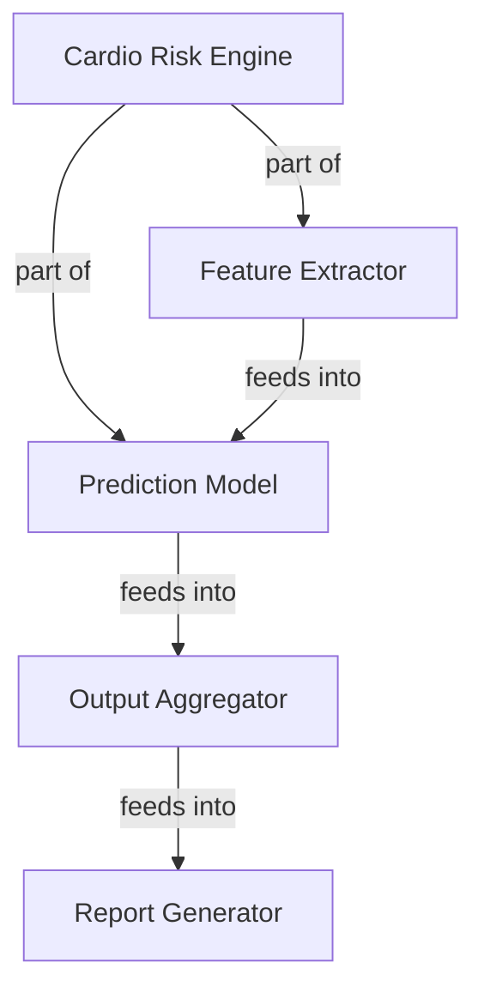

# Living Knowledge Spine

**Living Knowledge Spine** is a Notion-native AI system that turns messy daily voice notes, meeting notes, and fragmented work updates into an evolving visual knowledge structure.

> Notion should not only store what I wrote; it should continuously organize what I understand.

Instead of organizing notes manually, users simply add a messy note into Notion. The system extracts concepts and relationships, updates a visual knowledge backbone, and enables structured recall — so users can navigate from a high-level concept down to the specific detail they need.

## Architecture

Built as a **Notion Worker** (TypeScript) with four agent tools, deployed via the `ntn` CLI.

```
src/
├── index.ts                         # Worker entry — registers all 4 tools
├── tools/
│   ├── updateKnowledgeSpine.ts      # Process note → extract → update DBs
│   ├── findRecallPath.ts            # Query → structured recall path
│   ├── generateKnowledgeMap.ts      # Build Mermaid diagram from graph
│   └── detectKnowledgeGaps.ts       # Find weak/missing nodes
├── lib/
│   ├── extraction.ts                # OpenAI-based concept extraction
│   ├── graph.ts                     # In-memory graph + BFS path-finding
│   ├── notion-helpers.ts            # Notion API wrappers
│   └── types.ts                     # Shared TypeScript types
└── setup/
    └── seed.ts                      # Sample data seeder
```

## Agent Tools

| Tool | Purpose |
|------|---------|
| **updateKnowledgeSpine** | Process a raw note: extract concepts & relationships via AI, create/update knowledge nodes, log changes |
| **findRecallPath** | Given a question, find a structured path from root concept → branch → detail |
| **generateKnowledgeMap** | Generate a Mermaid diagram of the full knowledge graph |
| **detectKnowledgeGaps** | Identify low-confidence nodes, orphans, open questions, stale entries |

## Prerequisites

- **Node.js** 22+
- **npm** 10+
- **Notion CLI** (`ntn`)
- **OpenAI API key** (for concept extraction)
- A **Notion workspace** on Business plan or above (required for Workers)

## Setup

### 1. Install the Notion CLI

```bash
curl -fsSL https://ntn.dev | bash
```

### 2. Clone and install

```bash
git clone https://github.com/changboyen1018/Notion-Living-Knowledge-Spine.git
cd Notion-Living-Knowledge-Spine
npm install
```

### 3. Create Notion databases

Create these 5 databases in your Notion workspace:

**Raw Notes**
| Property | Type | Notes |
|----------|------|-------|
| Name | Title | Auto title for the note |
| Date | Date | When the note was captured |
| Source Type | Select | Options: `voice`, `meeting`, `manual`, `slack` |
| Raw Transcript | Rich Text | The full note content |
| Domain | Select | Knowledge domain (e.g. "Cardio Risk Engine") |
| Processed | Checkbox | Whether the note has been processed |

**Knowledge Nodes**
| Property | Type | Notes |
|----------|------|-------|
| Name | Title | Concept name |
| Type | Select | Options: `system`, `component`, `concept`, `decision`, `question` |
| Summary | Rich Text | 1-2 sentence description |
| Parent Node | Relation → self | Hierarchical parent |
| Source Notes | Relation → Raw Notes | Notes that contributed to this node |
| Confidence | Number (0-1) | How well-evidenced this concept is |
| Last Updated | Date | Auto-updated on changes |
| Domain | Select | Knowledge domain |

**Relationships**
| Property | Type | Notes |
|----------|------|-------|
| Name | Title | Auto: "Source → Target" |
| Source Node | Relation → Knowledge Nodes | |
| Relationship Type | Select | Options: `depends_on`, `feeds_into`, `owned_by`, `blocked_by`, `related_to`, `part_of` |
| Target Node | Relation → Knowledge Nodes | |
| Evidence | Rich Text | Quote from source note |
| Confidence | Number (0-1) | |

**Recall Paths**
| Property | Type | Notes |
|----------|------|-------|
| Question | Title | The user's recall query |
| Path Nodes | Rich Text | JSON array of path steps |
| Explanation | Rich Text | Human-readable recall path |
| Source Evidence | Rich Text | Supporting evidence |

**Change Log**
| Property | Type | Notes |
|----------|------|-------|
| Entry | Title | Auto: "changeType: nodeName" |
| Date | Date | |
| Updated Node | Relation → Knowledge Nodes | |
| Change Type | Select | Options: `created`, `updated`, `merged`, `linked` |
| Source Note | Relation → Raw Notes | |

### 4. Store secrets

```bash
# OpenAI API key
ntn workers secret set OPENAI_API_KEY

# Database IDs (find in each database's URL: notion.so/<workspace>/<DATABASE_ID>)
ntn workers secret set RAW_NOTES_DB_ID
ntn workers secret set KNOWLEDGE_NODES_DB_ID
ntn workers secret set RELATIONSHIPS_DB_ID
ntn workers secret set RECALL_PATHS_DB_ID
ntn workers secret set CHANGE_LOG_DB_ID
```

For local testing, copy `.env.example` to `.env` and fill in the values.

### 5. Seed sample data (optional)

```bash
npm run seed
```

This populates the Raw Notes database with 5 realistic notes from a fictional "Cardio Risk Engine" project.

### 6. Deploy

```bash
ntn workers deploy
```

### 7. Connect to a Custom Agent

In Notion, go to **Settings → Connections → Custom Agents** and attach this worker. Enable the tools you want the agent to use.

## Usage

### Process a note

```bash
ntn workers exec updateKnowledgeSpine -d '{"noteId": "your-note-page-id"}'
```

The tool reads the note, extracts concepts via OpenAI, creates/updates knowledge nodes and relationships, and returns a change summary.

### Recall knowledge

```bash
ntn workers exec findRecallPath -d '{"query": "report generation"}'
```

Returns a structured path: Root → Branch → Component → Detail, with summaries at each level.

### Generate a knowledge map

```bash
ntn workers exec generateKnowledgeMap -d '{"domain": null}'
```

Returns a Mermaid diagram string:



### Detect knowledge gaps

```bash
ntn workers exec detectKnowledgeGaps -d '{"domain": null, "staleDays": 14}'
```

Returns prioritised gaps: open questions, low-confidence nodes, orphans, and stale entries.

## How It Works

1. User writes or records a messy note → saved to **Raw Notes** database
2. User (or agent) calls **updateKnowledgeSpine** with the note ID
3. The tool sends the note text to OpenAI, which extracts concepts, relationships, and open questions
4. Each concept is fuzzy-matched against existing **Knowledge Nodes** — matched nodes are updated (confidence increases), new nodes are created
5. Relationships are added to the **Relationships** database
6. All changes are logged to the **Change Log**
7. The note is marked as processed
8. Later, the user can **findRecallPath** to navigate from a high-level system down to specific details, or **generateKnowledgeMap** for a visual overview

## Local Testing

```bash
# Copy env template
cp .env.example .env
# Fill in your Notion token and database IDs

# Run a tool locally
ntn workers exec updateKnowledgeSpine --local -d '{"noteId": "..."}'
```
